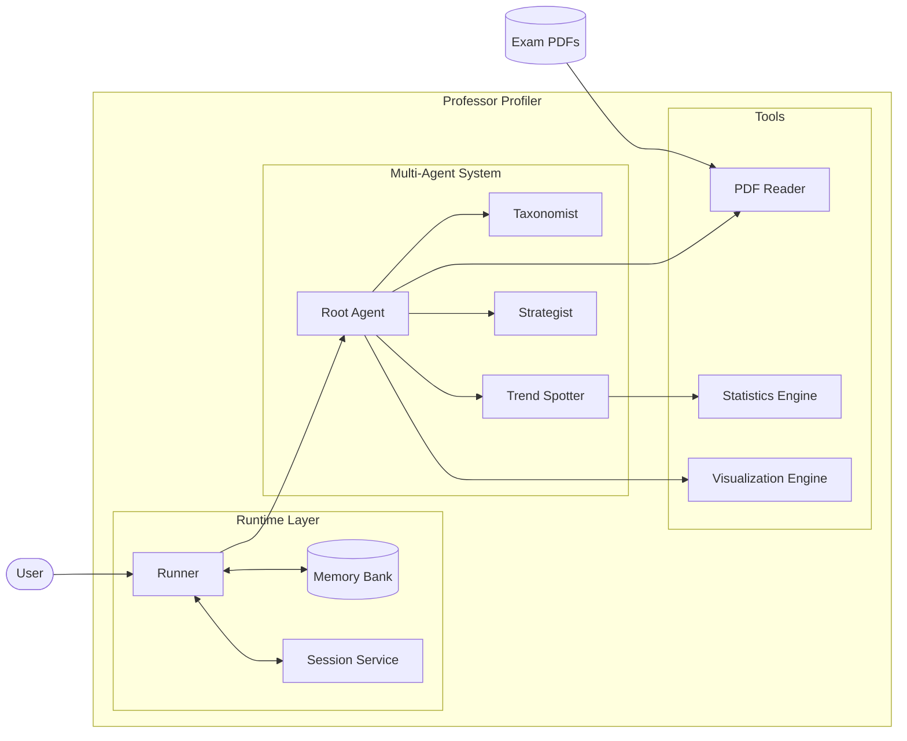

# Professor Profiler

> **An advanced hierarchical multi-agent system that reverse-engineers exam papers using NVIDIA NIM and Google Gemini to decode topic weights and cognitive complexity, outputting optimized study recommendations.**

---

## Overview

Professor Profiler is a Hierarchical Multi-Agent System (HMAS) designed to mimic the cognitive process of an expert academic coach. By orchestrating specialized worker agents powered by NVIDIA NIM (with optional Google Gemini fallback), it ingests exam PDFs, classifies questions (using Bloom's Taxonomy), tracks statistical trends, and formulates high-impact study plans.

This project serves as a reference implementation for:
*   Hub-and-Spoke Agent Architecture
*   Hosted LLM Integration via NVIDIA NIM (OpenAI-compatible) and Google Gemini (fallback)
*   Long-term Memory Management (JSON-persisted memory banks)
*   Production-grade Observability (tracing, request count, and latency metrics)

---

## System Architecture

The system creates a directed acyclic graph (DAG) of agent execution, managed by a central orchestrator.

### High-Level Design



---

## Tech Stack

| Component | Technology | Description |
| :--- | :--- | :--- |
| **Core Logic** | Python 3.10+ | Type-hinted, async-native codebase. |
| **LLM Provider** | NVIDIA NIM | OpenAI-compatible endpoint hosting high-performance open models. |
| **Fallback Engine** | Google Gemini | Rollback path when NIM fails or for comparison testing. |
| **Document Processing** | `pypdf` | Robust text extraction from exam PDFs. |
| **Visualization** | `matplotlib` | Generates distribution bar charts and pie charts. |
| **Observability** | Custom Logging | Structured logging with latency and success metrics. |
| **Configuration** | `python-dotenv` | Environment variable validation and typed configurations. |

---

## Agent Personas

The system splits the cognitive load across three distinct worker agents:

### 1. The Taxonomist (Classifier)
*   **Model:** `meta/llama-3.1-70b-instruct` (NIM) | `gemini-2.0-flash-exp` (Gemini)
*   **Role:** The meticulous grader. It reads every question and tags it with a topic and Bloom's Taxonomy Level (Remember, Understand, Apply, Analyze, Evaluate, Create).

### 2. The Trend Spotter (Analyst)
*   **Model:** `meta/llama-3.3-70b-instruct` (NIM) | `gemini-2.0-pro-exp` (Gemini)
*   **Role:** The data scientist. It looks at the frequency and cognitive complexity distribution to isolate shifts and outliers.

### 3. The Strategist (Coach)
*   **Model:** `meta/llama-3.3-70b-instruct` (NIM) | `gemini-2.0-pro-exp` (Gemini)
*   **Role:** The academic coach. It aggregates findings into a study recommendation containing a Hit List, Safe Zone, and Drop List.

---

## Getting Started

### Prerequisites
1. **Python 3.10** or higher.
2. **NVIDIA NIM API Key** (obtain from build.nvidia.com).
3. *Optional:* Google Gemini API Key if enabling fallback.

### Installation

#### Linux / macOS
```bash
# 1. Clone the repository
git clone https://github.com/uffamit/Professor_Profiler.git
cd Professor_Profiler

# 2. Create and activate a virtual environment
python3 -m venv .venv
source .venv/bin/activate

# 3. Install requirements
pip install -r requirements.txt
```

#### Windows
```powershell
# 1. Clone the repository
git clone https://github.com/uffamit/Professor_Profiler.git
cd Professor_Profiler

# 2. Create and activate a virtual environment
python -m venv .venv
.venv\Scripts\Activate.ps1

# 3. Install requirements
pip install -r requirements.txt
```

### Configuration

Create a `.env` file in the root directory.

#### Linux / macOS Setup
```bash
cp .env.example .env
```

#### Windows Setup (Command Prompt)
```cmd
copy .env.example .env
```

#### Windows Setup (PowerShell)
```powershell
Copy-Item .env.example .env
```

Open the `.env` file and configure the settings:
```ini
# Provider Selection: nim or gemini
LLM_PROVIDER=nim

# NVIDIA NIM Configuration
NIM_API_KEY=your_nvidia_api_key_here
NIM_BASE_URL=https://integrate.api.nvidia.com/v1
NIM_TIMEOUT=120
NIM_CLASSIFIER_MODEL=meta/llama-3.1-70b-instruct
NIM_ANALYZER_MODEL=meta/llama-3.3-70b-instruct

# Optional Fallback to Gemini
ENABLE_FALLBACK=true
GOOGLE_API_KEY=your_google_gemini_key_here
GEMINI_CLASSIFIER_MODEL=gemini-2.0-flash-exp
GEMINI_ANALYZER_MODEL=gemini-2.0-pro-exp
```

---

## Usage

### 1. Interactive Execution (Recommended)
Place your exam PDF inside the `input/` folder, then run the startup runner:

#### Linux / macOS
```bash
python3 run.py
```

#### Windows
```powershell
python run.py
```

This script will:
- Check for existing PDFs in `input/`. If empty, it automatically generates three sample exams using `create_sample_exams.py`.
- Prompt you to select a PDF for analysis.
- Execute the orchestrator and all sub-agents sequentially.
- Save a structured Markdown study report to `output/reports/`.
- Print request metrics (total requests, average latency, and fallback counts).

### 2. Running the Benchmarks
To compare latency and execution between NVIDIA NIM and Google Gemini:

#### Linux / macOS
```bash
python3 scripts/benchmark_nim_vs_gemini.py
```

#### Windows
```powershell
python scripts/benchmark_nim_vs_gemini.py
```

### 3. Verification & Testing
To execute the automated test suites:

#### Linux / macOS
```bash
# Run unit and migration tests
pytest tests/test_nim_migration.py

# Run integration tests
pytest tests/test_nim_full_integration.py

# Run agent routing tests
pytest tests/test_agent.py
```

#### Windows
```powershell
# Run unit and migration tests
pytest tests/test_nim_migration.py

# Run integration tests
pytest tests/test_nim_full_integration.py

# Run agent routing tests
pytest tests/test_agent.py
```

---

## Project Structure

```text
Professor_Profiler/
├── input/                      # Exam PDF inputs
├── output/                     # Generated artifacts
│   ├── charts/                 # Visualizations (.png)
│   ├── logs/                   # Execution log files
│   └── reports/                # Markdown study recommendations
├── google/adk/                 # Custom Agent Development Kit (ADK)
│   ├── agents/                 # Base Agent & tool execution
│   ├── clients/                # NIM Client wrapping AsyncOpenAI
│   └── runners/                # Orchestrator Runner
├── profiler_agent/             # App-specific agents and configurations
│   ├── sub_agents/             # Taxonomist, Trend Spotter, Strategist
│   ├── tools.py                # Ingestion, Stats, and Viz tools
│   └── config.py               # Provider settings
├── run.py                      # Interactive startup runner
├── demo.py                     # Feature demo runner
└── tests/                      # Automated test suite
```

---

## Troubleshooting

| Issue | Cause | Solution |
| :--- | :--- | :--- |
| KeyError / 404 Not Found | Model not active on tier | Switch NIM models in `.env` to meta family (e.g. `meta/llama-3.1-70b-instruct`). |
| TypeError: ARC4 | Warning message | Cryptography warning from pypdf. Safe to ignore or update cryptography package. |
| asyncio.TimeoutError | Slow hosted API endpoint | Increase `NIM_TIMEOUT` inside `.env` to `120` or higher. |
| 401 Unauthorized | Invalid key | Verify `NIM_API_KEY` or `GOOGLE_API_KEY` is loaded correctly in `.env`. |

---

## License

Distributed under the MIT License. See [LICENSE](LICENSE) for more details.

**Maintained by [uffamit](https://github.com/uffamit)**  
Website: [amitdevx.tech](https://amitdevx.tech)
